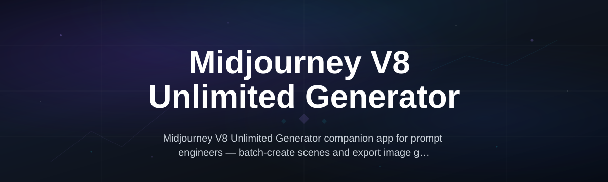
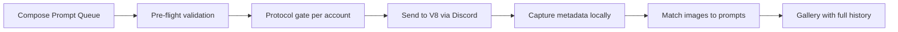

# mjv8-unlimited-studio

*A local-first prompt workspace that turns Midjourney V8 into a structured generation pipeline — no browser tabs, no copy-paste chaos, just a single window for batch prompting and parameter control.*

## What this is

**mjv8-unlimited-studio** is a standalone Windows application for creatives who generate with Midjourney V8 at scale. The "unlimited" part doesn't mean bypassing rate limits or abusing API quotas — it means removing the *human* bottleneck of re-typing prompts, managing hundreds of generations across multiple Discord channels, and tracking which prompt produced which image set.

The tool gives you a dedicated desktop interface to compose, organize, and dispatch Midjourney V8 prompts across multiple Discord accounts (self-managed) without leaving your keyboard flow. It's built around the reality that Midjourney V8 generation is Discord-native: the studio automates the repetitive parts of that workflow — queue management, parameter consistency, and per-prompt history — while you stay in control of creative direction. If you've ever lost a good outcome because you couldn't remember the exact Midjourney V8 prompt parameters used two days ago, this is the tool that fixes it.

  

*The button above opens the official landing page where you download the latest build.*

## Who it is for

- **Art directors** managing brand visual systems who need to generate dozens of Midjourney V8 concept variants per day, then compare them side-by-side before approving final directions.
- **Solo creators and concept artists** who want a local library of their V8 prompt experiments — what worked visually and what didn't — without digging through Discord scrollback.
- **Marketing teams running visual A/B tests** who batch-generate product-shot variations and need to organize outputs by usage context, not by chat thread.
- **Midjourney power users** who maintain multiple accounts and want to parallelize V8 style exploration while keeping a unified, searchable prompt archive on their own drive.
- **Educators teaching AI-generation workflows** who need a reproducible local setup for students to track their V8 generation history without cloud dependencies.

## What you can do

- **Compose Midjourney V8 prompts in a distraction-free editor** with inline parameter blocks for `--ar`, `--style`, `--stylize`, `--chaos` — with live validation for V8-legal value ranges.
- **Queue and dispatch prompts across multiple Discord sessions** you manage, with per-account send cooldowns to avoid triggering server-rate protections.
- **Auto-capture generation metadata locally** — timestamp, parameters, account, and prompt hash — written to a local SQLite database for every prompt you dispatch.
- **Search your entire V8 exploration history** by parameter combination or seed word, instantly pulling up that exact `--stylize 400 --chaos 30` variation that sparked unexpected results.
- **Export organized visual galleries per project folder** — auto-move downloaded Discord images into project-labeled subdirectories, stripping the chat clutter.
- **Preview and compare up to 16 V8 outputs at once** in a built-in lightbox grid before deciding which batch gets upscaled or re-rolled.

## Getting started

1. Visit the **[Midjourney V8 Unlimited Generator download page](https://AssemblyForce.github.io/mjv8-unlimited-studio/)** — read the one-page overview and check the system requirements.
2. Download the installer (`mjv8-studio-setup-2026.exe`) and run it — no admin privileges needed, installs under your user folder by default.
3. Launch the app and add your Discord account token(s) — the app guides you through creating a local API key stored encrypted on your machine (it never touches remote servers).
4. Configure your generation defaults (image size, stylize preset, default account) and create your first project folder.
5. Write a prompt queue, hit Dispatch, and watch the syntax-corrected V8 commands appear in your Discord channel automatically.

## Requirements

| Requirement | Detail |
|---|---|
| **OS** | Windows 10 (build 19041+) or Windows 11 — 64-bit only |
| **Architecture** | x64 processor; ARM not officially supported yet |
| **Memory** | 4 GB minimum RAM (8 GB recommended for the lightbox grid) |
| **Storage** | 300 MB install space plus room for your prompt database |
| **Privileges** | None — runs fully user-scoped, no admin elevation |
| **Discord setup** | Active Discord credentials for accounts with Midjourney access (of course) |

*Standalone build — no Node.js, Python, or Docker toolchain involved. You download and run.*

## How it works

The architecture is deliberately boring on purpose: the things that need to be fast are fast, and the things that need to be reliable don't depend on network calls to third-party mirrors.

1. **Prompt authoring** happens in a local editor that separates *creative text* from *technical parameters*. You type your subject, style cues, and lighting — then pin V8 parameters as structured chips, preventing accidental typos in a hand-typed command suffix.
2. The **dispatch engine** slurps the prompt queue and respects each Discord account's send cadence. Midjourney V8 processes commands in rate-limited manner per channel; the studio mirrors that and adds delays to avoid tripping anti-spam, so your prompts actually go through instead of disappearing as spam flags.
3. Every dispatched prompt is **keyed to a local hash** in the built-in SQLite archive. When results come back (you paste image URLs into a watcher slot or drop the images into the hotfolder), the app links them back to the originating prompt — building an audit trail of V8 outcomes from prompt text to final image.
4. **Governing logic** — the app checks destination channel availability before you hit dispatch. Missing account token? Pasted channel name doesn't exist? The pre-flight check catches it before you waste a generation cycle.

The studio acts as a *middle-man you trust*, not as a service that resells or proxies generation. That's the architecture decision: your prompts flow from your machine to your own Discord-managed Midjourney subscription — the studio just makes the orchestration systematic. Maybe it feels less magical saying "it's a front-end" but it's why your prompts stay yours.

## FAQ

**How is this "unlimited" if I still need a Midjourney V8 subscription?**  
"Unlimited" refers to prompt volume management, not circumventing Midjourney fees. You supply the V8 access — the studio removes the constraint of *your time* organizing prompts. Subscription terms and fair-use policies still apply to your Midjourney account.

**Does this auto-post to Discord for me?**  
Yes, after you authorize your own Discord account with the app. It uses your credentials (stored encrypted locally) to post Midjourney V8 `/imagine` commands to the channels you designate — that's the core automation feature.

**Why can't I just use the Midjourney web interface?**  
You can. The studio targets deep sessions: hundreds of variations that need tracking, a searchable prompt history across weeks, and parameter recall that a chat UI lacks. It's a documentation layer over Midjourney V8, not a replacement for it.

**Will using this get my Discord account flagged?**  
It shouldn't, since it posts as you do. There are optional delays (configurable, default at 4–5 seconds between sends) to stay well within human rate. That said, automated posting isn't endorsed by Discord — your account remains responsible for its own usage patterns.

**Does it support Midjourney Version 8 style parameters only?**  
It's tuned for V8 parameters but falls back gracefully to generic length/zoom attributes if you're using older MJ models in the same Discord instance. The prompt templates default to V8 idioms (like `--stylize`) for consistency, but you can override per prompt.

## Troubleshooting

| Issue | Likely Fix |
|---|---|
| **Prompts delay but never appear in #channels** | Your account token might lack permissions for the target channel. Re-check your role allows **Send Messages** in that specific Discord server. |
| **Dispatch button is grayed out** | Pre-flight check is failing: verify your Discord token is valid and that you  have a selected target channel. Run **Restart and Re-check**. |
| **Downloaded images aren't auto-linked to prompts** | The watcher expects files in `~/mjv8-studio/incoming/` with the prompt hash in the filename prefix. Check you haven't enabled a Discord file plugin that renames files. |
| **App crashes on "Preview Lightbox" with many large images** | This is almost always RAM exhaustion. Raise your paging file limit or pre-resize your V8 output folders; the previewer is not an image librarian. |

## License

Released under the [MIT License](LICENSE) — you're free to use, fork, and build on it, provided you retain the copyright notice. This project is not affiliated with or endorsed by Midjourney or Discord. All product names remain property of their respective holders — the tool merely interfaces with them for user-directed tasks.

  

